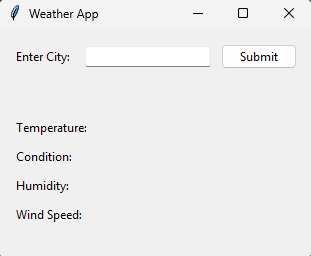

# Weather App using Tkinter

This application is a GUI-based weather app built using Python's Tkinter library. It allows users to enter a city name and fetch the current weather data for that city using an external weather API.

---

## Features
- User-friendly graphical interface.
- Fetches real-time weather data.
- Displays temperature, weather condition, humidity, and wind speed.

---

## Modules Used
- **tkinter**: For building the graphical user interface.
- **requests**: For making HTTP requests to fetch weather data.
- **dotenv**: For loading environment variables from a `.env` file.
- **os**: For accessing environment variables.

---

## Classes
### 1. GUI
- Inherits from `tk.Tk`.
- Builds the main graphical interface of the application.
- Contains widgets like labels, entry fields, and buttons.
- Displays weather information such as:
  - Temperature
  - Condition
  - Humidity
  - Wind Speed

### 2. Weather
- Handles the logic for fetching weather data from the API.
- Uses the city name provided by the user to get geographical coordinates.
- Fetches weather details like:
  - Temperature
  - Condition
  - Humidity
  - Wind Speed

---

## How It Works
1. The user enters a city name in the input field and clicks the **Submit** button.
2. The `display` method in the `GUI` class is triggered, which creates an instance of the `Weather` class.
3. The `Weather` class fetches the weather data from the API and returns it to the `display` method.
4. The weather data is displayed in the GUI.

---

## Environment Variables
Ensure the following environment variables are set in a `.env` file:
- **APPID**: The API key for accessing the weather service.
- **GEO_URL**: The URL for the geocoding API.
- **DATA_URL**: The URL for the weather data API.

---

## Images
Below are some screenshots of the application:

### Main Interface

### Weather Display

---

## Note
Ensure that the `.env` file contains the required environment variables (**APPID**, **GEO_URL**, **DATA_URL**) for the application to function correctly.